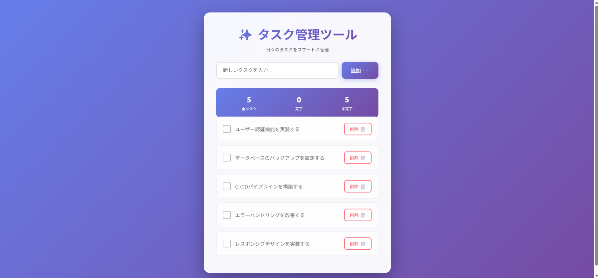

# Webタスク管理ツール

このプロジェクトは、**個人用の学習・開発目的**で作成されたシンプルなWebタスク管理ツールです。

> **注意**: このアプリケーションは個人利用を想定しており、本番環境での使用や商用利用は想定していません。認証機能やセキュリティ対策は実装されていないため、機密性の高い情報は扱わないでください。

## 画面イメージ



モダンで使いやすいユーザーインターフェースを実装しています。グラデーション背景とカードベースのレイアウトで、直感的にタスクを管理できます。

## 技術スタック

### フロントエンド
- React 18
- Webpack 5
- Babel 7

### バックエンド
- Node.js
- Express 4
- JSONファイルによるデータ永続化

## プロジェクト構成

```
web-manage-tasks/
├── README.md
├── client/              # フロントエンド
│   ├── App.jsx         # メインReactコンポーネント
│   ├── index.js        # エントリーポイント
│   ├── package.json
│   ├── webpack.config.js
│   └── public/
│       └── index.html
└── server/              # バックエンド
    ├── index.js        # Express APIサーバー
    ├── package.json
    └── tasks.json      # タスクデータ保存
```

## 機能

- ✅ タスク一覧表示
- ✅ タスク追加（Enterキー対応）
- ✅ タスク削除
- ✅ タスク完了チェックボックス
- ✅ タスク統計表示（全タスク/完了/未完了）
- ✅ モダンなUIデザイン
  - グラデーション背景
  - カードベースのレイアウト
  - ホバーエフェクト
  - スムーズなアニメーション
  - レスポンシブデザイン

## APIエンドポイント

| メソッド | エンドポイント | 説明 |
|---------|---------------|------|
| GET     | /api/tasks    | タスク一覧を取得 |
| POST    | /api/tasks    | 新しいタスクを追加 |
| DELETE  | /api/tasks/:id | 指定したIDのタスクを削除 |

## セットアップ手順

### 1. 依存パッケージのインストール

#### サーバー側
```bash
cd server
npm install
```

#### クライアント側
```bash
cd client
npm install
```

### 2. アプリケーションの起動

#### サーバーを起動（ターミナル1）
```bash
cd server
npm run dev
```
サーバーは http://localhost:3001 で起動します。

#### クライアントを起動（ターミナル2）
```bash
cd client
npm start
```
ブラウザが自動的に開き、http://localhost:3000 でアプリケーションにアクセスできます。

## Docker での使用方法

Dockerを使用すると、環境構築なしですぐにアプリケーションを起動できます。

### 起動

```bash
docker-compose up --build
```

初回起動時は依存関係のインストールとイメージのビルドに数分かかる場合があります。

### アクセス

- **アプリケーション**: http://localhost:3000
- **API**: http://localhost:3001/api/tasks

### ホットリロード

クライアント・サーバー両方のコード変更が自動的に反映されます。

- `client/` 内のファイルを編集すると、ブラウザが自動的にリロードされます
- `server/` 内のファイルを編集すると、サーバーが自動的に再起動します

### 停止

```bash
docker-compose down
```

### データのリセット

タスクデータを完全にリセットする場合：

```bash
docker-compose down -v
```

このコマンドはボリュームを削除し、`tasks.json` をクリーンな状態に戻します。

### トラブルシューティング

#### ポートが既に使用されている場合

`docker-compose.yml` の `ports` セクションを編集して、別のポート番号に変更してください。

#### ホットリロードが機能しない場合

Windows/Mac環境でファイル監視が機能しない場合は、`docker-compose.yml` の環境変数 `CHOKIDAR_USEPOLLING=true` が設定されていることを確認してください。

## テスト

このプロジェクトには、バックエンドとフロントエンドの両方に対する包括的なテストスイートが含まれています。

### テストの実行

#### サーバー側テスト
```bash
cd server
npm test
```

#### クライアント側テスト
```bash
cd client
npm test
```

### カバレッジレポートの生成

#### サーバー側
```bash
cd server
npm run test:coverage
```

#### クライアント側
```bash
cd client
npm run test:coverage
```

カバレッジレポートは各ディレクトリの `coverage/` フォルダに生成されます。

### テスト内容

#### バックエンド（Jest + Supertest）
- APIエンドポイントの統合テスト
  - GET /api/tasks: タスク一覧取得
  - POST /api/tasks: タスク追加（バリデーション含む）
  - DELETE /api/tasks/:id: タスク削除
- エラーハンドリングのテスト
- ファイルI/O操作のモックテスト

#### フロントエンド（Jest + React Testing Library）
- コンポーネントレンダリングのテスト
- ユーザーインタラクションのテスト
  - タスク追加機能
  - タスク削除機能
  - 入力バリデーション
- API連携のモックテスト
- 状態管理のテスト

## 開発環境

- Node.js 14以上推奨
- npm または yarn

## 今後の拡張予定

- タスク編集機能
- タスクの並び替え
- タスクフィルタリング（完了/未完了）
- データベース対応（MongoDB、PostgreSQLなど）
- ユーザー認証機能
- タスクの期限設定
- タスクカテゴリ分類